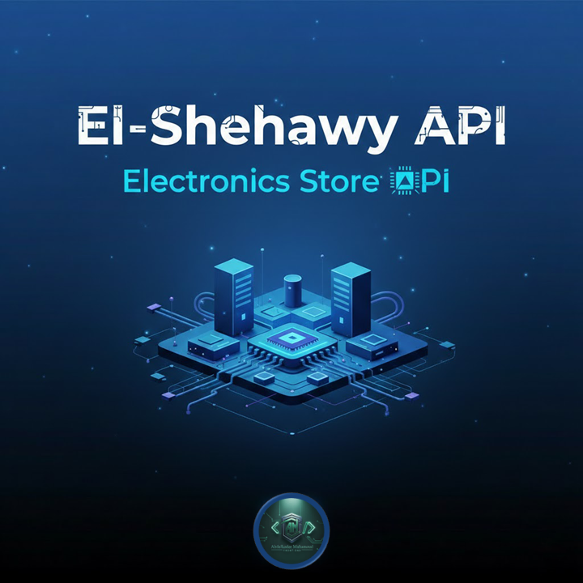

# 🏪 واجهة برمجة تطبيقات متجر الشهاوي للإلكترونيات (Electronics Store API)



واجهة برمجة تطبيقات (API) قوية وعالية الأداء مبنية باستخدام Node.js و Express.js. توفر هذه الخدمة بيانات تفصيلية لأكثر من 270 منتج إلكتروني من مختلف الفئات والماركات العالمية، مع ميزات متقدمة للبحث والفلترة وتقسيم الصفحات. تم تصميم الـ API لتكون سريعة، فعالة، وسهلة الاستخدام للمطورين.

---

## ✨ الميزات

-   **تحميل ديناميكي للبيانات:** يقوم السيرفر بقراءة وتحميل جميع ملفات `JSON` الخاصة بالمنتجات تلقائيًا عند بدء التشغيل.
-   **تخزين مؤقت عالي الأداء (Caching):** يتم تخزين جميع البيانات في الذاكرة لضمان استجابة فائقة السرعة للطلبات.
-   **بحث وفلترة متقدمة:** يمكنك البحث عن المنتجات بالاسم، الوصف، الفئة، اللون، السعر، وسنة الموديل.
-   **تقسيم صفحات ذكي (Smart Pagination):** للتحكم في كمية البيانات المُرجعة والحفاظ على الأداء العالي.
-   **نقاط وصول شاملة (Comprehensive Endpoints):** للحصول على كل المنتجات، أو منتجات فئة معينة، أو حتى منتج واحد محدد.
-   **إحصائيات متقدمة:** إحصائيات مفصلة عن المنتجات، الأسعار، الألوان، والفئات.

---

## 🚀 التثبيت والتشغيل

1.  **المتطلبات الأساسية:**
    تأكد من أن لديك [Node.js](https://nodejs.org/) (الإصدار 14 أو أعلى) مثبت على جهازك.

2.  **نسخ المشروع:**
    ```bash
    git clone <project-repository-url>
    cd <project-folder-name>
    ```

3.  **تثبيت الاعتماديات (Dependencies):**
    ```bash
    npm install express cors helmet morgan dotenv
    ```

4.  **تشغيل السيرفر:**
    ```bash
    node server.js
    ```

5.  عند التشغيل الناجح، ستظهر الرسالة التالية في وحدة التحكم (Terminal):
    ```
    🚀 Server is running on http://localhost:3000
    📅 Date: Monday, February 23, 2026
    🕐 Time: 01:28 AM (Cairo Time)
    📦 Total categories loaded: 13
    ```

---

## 📚 دليل نقاط الوصول (API Endpoints Guide)

**الرابط الأساسي (Base URL):** `http://localhost:3000`

### 🏠 1. الصفحة الرئيسية
-   **Endpoint:** `GET /`
-   **الوصف:** صفحة الترحيب التي تعرض جميع نقاط الوصول المتاحة.
-   **الرابط:** `http://localhost:3000/`

---

### 📥 2. جلب كل المنتجات
-   **Endpoint:** `GET /api/products/all`
-   **الوصف:** يقوم بجلب قائمة بجميع المنتجات. يدعم تقسيم الصفحات بشكل افتراضي لتحسين الأداء.
-   **Parameters:**
    -   `page` (اختياري): رقم الصفحة. الافتراضي `1`.
    -   `limit` (اختياري): عدد النتائج في الصفحة. الافتراضي `20`.
    -   `pagination` (اختياري): لتعطيل التقسيم وجلب كل المنتجات، استخدم القيمة `false`.
-   **مثال (مع تقسيم الصفحات):** `http://localhost:3000/api/products/all?page=2&limit=10`
-   **مثال (بدون تقسيم الصفحات):** `http://localhost:3000/api/products/all?pagination=false`

---

### 🔍 3. البحث والفلترة المتقدمة
-   **Endpoint:** `GET /api/products/search`
-   **الوصف:** يقوم بالبحث في جميع المنتجات بناءً على معايير محددة.
-   **Parameters:**
    -   `q` (اختياري): للبحث عن كلمة في اسم أو وصف المنتج.
    -   `category` (اختياري): للفلترة حسب الفئة.
    -   `color` (اختياري): للفلترة حسب اللون.
    -   `minPrice` (اختياري): للفلترة حسب السعر الأدنى.
    -   `maxPrice` (اختياري): للفلترة حسب السعر الأقصى.
    -   `minYear` (اختياري): للفلترة حسب سنة الموديل الأدنى.
    -   `maxYear` (اختياري): للفلترة حسب سنة الموديل الأقصى.
    -   `page`, `limit` (اختياري): لتقسيم صفحات نتائج البحث.
-   **مثال:** `http://localhost:3000/api/products/search?q=gaming&minPrice=1000&maxPrice=5000&category=cpu`

---

### 🆔 4. جلب منتج محدد بالـ ID
-   **Endpoint:** `GET /api/products/:id`
-   **الوصف:** يقوم بجلب بيانات منتج واحد محدد عن طريق الـ ID الخاص به.
-   **مثال:** `http://localhost:3000/api/products/1`
-   **مثال لـ ID غير موجود:** `http://localhost:3000/api/products/9999`

---

### 🗂️ 5. جلب المنتجات حسب الفئة

#### **🔹 المكونات الأساسية**

##### **المعالجات (CPUs) - 10 منتج**
-   **النوع:** معالجات كمبيوتر من Intel و AMD.
-   **الرابط:** `http://localhost:3000/api/products/category/cpu`

##### **كروت الشاشة (GPUs) - 10 منتج**
-   **النوع:** كروت شاشة من NVIDIA و AMD.
-   **الرابط:** `http://localhost:3000/api/products/category/gpu`

##### **الرامات (RAM) - 10 منتج**
-   **النوع:** ذواكر وصول عشوائي من Corsair و Kingston و G.Skill.
-   **الرابط:** `http://localhost:3000/api/products/category/ram`

##### **اللوحات الأم (Motherboards) - 10 منتج**
-   **النوع:** لوحات أم من ASUS و MSI و Gigabyte.
-   **الرابط:** `http://localhost:3000/api/products/category/motherboard`

##### **وحدات التخزين (Storage) - 10 منتج**
-   **النوع:** SSDs و HDDs من Samsung و Western Digital.
-   **الرابط:** `http://localhost:3000/api/products/category/storage`

#### **🔹 الأجهزة الطرفية**

##### **الشاشات (Screens) - 20 منتج**
-   **النوع:** شاشات من Samsung و LG و Dell.
-   **الرابط:** `http://localhost:3000/api/products/category/screen`

##### **الكيسات (Cases) - 20 منتج**
-   **النوع:** كيسات كمبيوتر من NZXT و Corsair و Cooler Master.
-   **الرابط:** `http://localhost:3000/api/products/category/case`

##### **الماوسات (Mice) - 20 منتج**
-   **النوع:** ماوسات من Logitech و Razer و SteelSeries.
-   **الرابط:** `http://localhost:3000/api/products/category/mouse`

##### **لوحات المفاتيح (Keyboards) - 20 منتج**
-   **النوع:** كيبوردات من Corsair و Razer و Logitech.
-   **الرابط:** `http://localhost:3000/api/products/category/keyboard`

##### **السماعات (Speakers) - 20 منتج**
-   **النوع:** سماعات من Logitech و JBL و Bose.
-   **الرابط:** `http://localhost:3000/api/products/category/speakers`

##### **الطابعات (Printers) - 20 منتج**
-   **النوع:** طابعات من HP و Canon و Epson.
-   **الرابط:** `http://localhost:3000/api/products/category/printers`

##### **الطابعات (laptops) - 20 منتج**
-   **النوع:** لاب توب من HP و Dell و Lenovo.
-   **الرابط:** `http://localhost:3000/api/products/category/laptops`

#### **🔹 الإكسسوارات**

##### **الإكسسوارات (Accessories) - 30 منتج**
-   **النوع:** إكسسوارات متنوعة مثل كابلات، مراوح، كولرز.
-   **الرابط:** `http://localhost:3000/api/products/category/accessories`

---

### 📊 6. إحصائيات المنتجات
-   **Endpoint:** `GET /api/products/stats`
-   **الوصف:** يعرض إحصائيات مفصلة عن جميع المنتجات.
-   **الرابط:** `http://localhost:3000/api/products/stats`

---

### 🌟 7. المنتجات المميزة
-   **Endpoint:** `GET /api/products/featured`
-   **الوصف:** يعرض منتجات مميزة مقسمة إلى: أحدث الموديلات، المنتجات الفاخرة، الوصلات الجديدة.
-   **الرابط:** `http://localhost:3000/api/products/featured`

---

### 🎲 8. منتجات عشوائية
-   **Endpoint:** `GET /api/products/random`
-   **الوصف:** يعرض منتجات عشوائية من جميع الفئات.
-   **Parameters:**
    -   `count` (اختياري): عدد المنتجات العشوائية المطلوبة. الافتراضي `5`.
-   **مثال:** `http://localhost:3000/api/products/random?count=10`

---

### 🔗 9. منتجات مشابهة
-   **Endpoint:** `GET /api/products/similar/:id`
-   **الوصف:** يعرض منتجات مشابهة لمنتج معين (من نفس الفئة).
-   **مثال:** `http://localhost:3000/api/products/similar/1`

---

### 🎨 10. فلترة متقدمة
-   **Endpoint:** `GET /api/products/filter`
-   **الوصف:** فلترة متقدمة مع إمكانية تطبيق أكثر من فلتر في نفس الوقت.
-   **Parameters:**
    -   `category` (اختياري): الفئة (يمكن تحديد أكثر من فئة مفصولة بفواصل).
    -   `minPrice`, `maxPrice` (اختياري): نطاق السعر.
    -   `color` (اختياري): اللون (يمكن تحديد أكثر من لون مفصولة بفواصل).
    -   `model` (اختياري): سنة الموديل.
    -   `sortBy` (اختياري): طريقة الترتيب (price, model, title).
    -   `sortOrder` (اختياري): اتجاه الترتيب (asc, desc).
-   **مثال:** `http://localhost:3000/api/products/filter?category=cpu,gpu&minPrice=1000&maxPrice=5000&sortBy=price&sortOrder=asc`

---

### 💰 11. فلترة حسب نطاق السعر
-   **Endpoint:** `GET /api/products/price-range/:range`
-   **الوصف:** فلترة المنتجات حسب نطاق سعر محدد.
-   **القيم المتاحة:** `budget`, `mid`, `premium`, `luxury`
-   **مثال:** `http://localhost:3000/api/products/price-range/mid`

---

### 🎨 12. فلترة حسب اللون
-   **Endpoint:** `GET /api/products/color/:color`
-   **الوصف:** فلترة المنتجات حسب اللون.
-   **مثال:** `http://localhost:3000/api/products/color/black`

---

### 📈 13. ترتيب المنتجات
-   **Endpoint:** `GET /api/products/sort`
-   **الوصف:** ترتيب المنتجات حسب معيار معين.
-   **Parameters:**
    -   `by` (اختياري): معيار الترتيب (price, model, title).
    -   `order` (اختياري): اتجاه الترتيب (asc, desc).
    -   `category` (اختياري): الفئة المحددة للترتيب.
-   **مثال:** `http://localhost:3000/api/products/sort?by=price&order=desc&category=cpu`

---

### 📋 14. قائمة الفئات
-   **Endpoint:** `GET /api/categories`
-   **الوصف:** يعرض قائمة بجميع الفئات المتاحة مع عدد المنتجات في كل فئة.
-   **الرابط:** `http://localhost:3000/api/categories`

---

## 📝 أمثلة للاستخدام

### **لعمل متجر إلكتروني:**
```javascript
// الصفحة الرئيسية
const featured = await fetch('http://localhost:3000/api/products/featured');

// صفحة الفئة
const cpus = await fetch('http://localhost:3000/api/products/category/cpu');

// صفحة المنتج
const product = await fetch('http://localhost:3000/api/products/15');

// البحث
const search = await fetch('http://localhost:3000/api/products/search?q=logitech&page=1&limit=12');